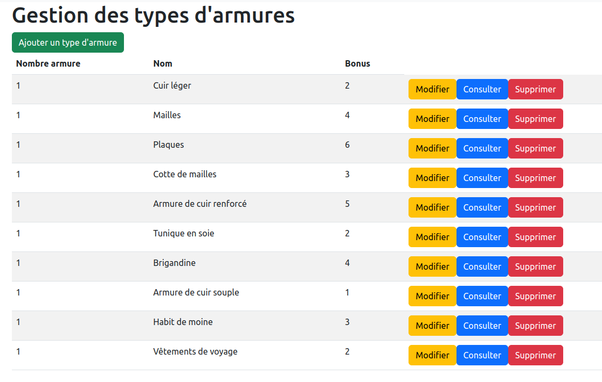

= Compte-rendu Epreuve E5
:toc:
== Sommaire

Réalisé par :

- CHONG TOUA Joshua

== Mission 1 Afficher le détail d'une bombe

Pour réaliser la mission 1 j'ai ajouter la fonction show dans le controlleur
de la Bombe, ce qui nous permettra de recupérer les données de la bombe grace à
son id.

----
@GetMapping("/admin/bombe/{id}")
    fun show(@PathVariable id: Long, model: Model): String {
        val bombe = this.bombeDao.findById(id).orElseThrow()
        model.addAttribute("bombe", bombe)
        return "admin/bombe/show"
    }
----

Ensuite j'ai créé le template show.html dans le dossier template/admin/bombe
pour avoir l'affichage sur le site.

----
[...]
    <main class="container">
        <h1>Détails de l'arme</h1>
        

            
<strong>Nom : </strong> 

            
<strong>Description : </strong> 

            

                

                    
<strong>cheminImage : </strong> 

                    
<strong>nbrDes : </strong> 

                    
<strong>maxDes : </strong> 

                

            

        

        

            <a th:href="@{'/admin/bombe/'+${bombe.id}+'/edit'}" class="btn btn-warning">
                Modifier
            </a>
            <a th:href="@{'/admin/bombe'}" class="btn btn-primary">
                Retour à la liste
            </a>
        

    </main>
[...]
----
image::../img/show.png[]

Puis pour le coté pratique j'ai ajouté le chemin dans
le fichier mesFragments.html pour y avoir accès sans ecrire
dans la barre de recherche.

----
[...]
    <li><a class="dropdown-item" th:href="@{'/admin/bombe'}">Bombe</a></li>
[...]
----

== Mission 2 Choisir une armure lors de la création du Personnage

Pour réaliser la mission 2, j'ai modifier la fonction create
du personnageController pour avoir accès à toutes les armures existantes,
en ajoutant la variable armures elle nous permettra de recupérer les armures puis, en
ajoutant "model.addAttribute("armures", armures)" cela nous permettra de récupérer les données dans les
templates.

----
@GetMapping("/joueur/personnage/create")
    fun create(model: Model): String {
        val nouvellePersonnage = Personnage(null, "", 1, 1, 1, 1)
        val armures = armureDao.findAll()
        model.addAttribute("nouvellePersonnage", nouvellePersonnage)
        model.addAttribute("armures", armures)
        return "joueur/personnage/create"
    }
----

Enusite pour pouvoir l'afficher dans le formulaire, j'ai modifier le template
create de personnage. J'ai rajouté:
----
[...]
    

        <label for="armure" class="form-label">Type d'Arme</label>
        <select class="form-select" id="armure" th:field="${nouvellePersonnage.armureEquipee.id}" required>
                <option disabled selected value="">Choisir une armure</option>
                <option th:each="unType : ${armures}" th:value="${unType.id}" th:text="${unType.nom}"></option>
        </select>
    

[...]
----
Résultat:

Le personnage a bien été créé avec l'armure selectionnée

== Mission 3 Nombre d'armures de chaque type armure

Pour réaliser cette mission j'ai modifier le template index de typeArmure
pour ajouter une nouvelle colonne et y afficher le nombre d'armure
de chaque type d'armure avec la fonction size.

----
[...]
<table class="table table-striped">
            <thead>
                <tr>
                    <th>Nombre armure</th>
                    <th>Nom</th>
                    <th>Bonus</th>
                </tr>
            </thead>
            <tbody>
                <tr th:each="unTypeArmure : ${typeArmures}">
                    <td th:text="${unTypeArmure.armures.size()}"></td>
[...]
----

Résultat:

Ajout d'une armure de type Brigandine:

Vérification:

La valeur a bien augmenté de 1.

